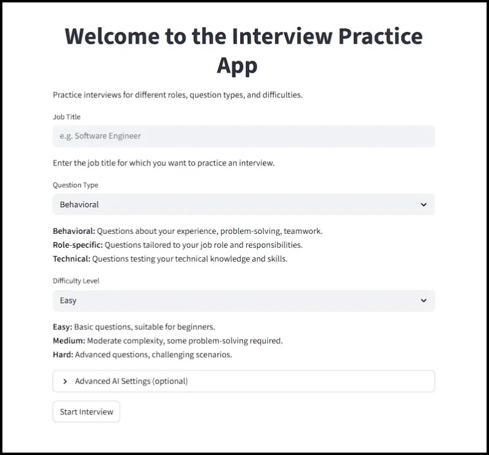
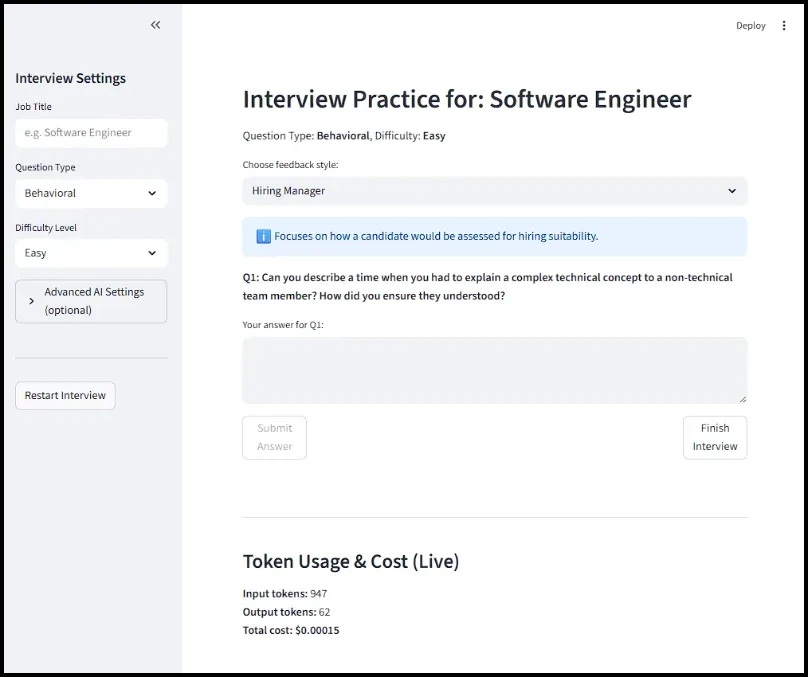
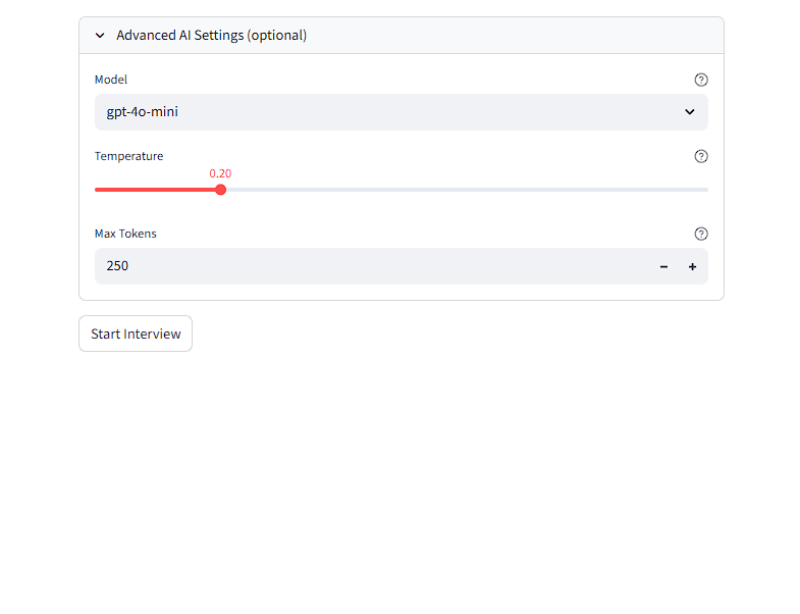
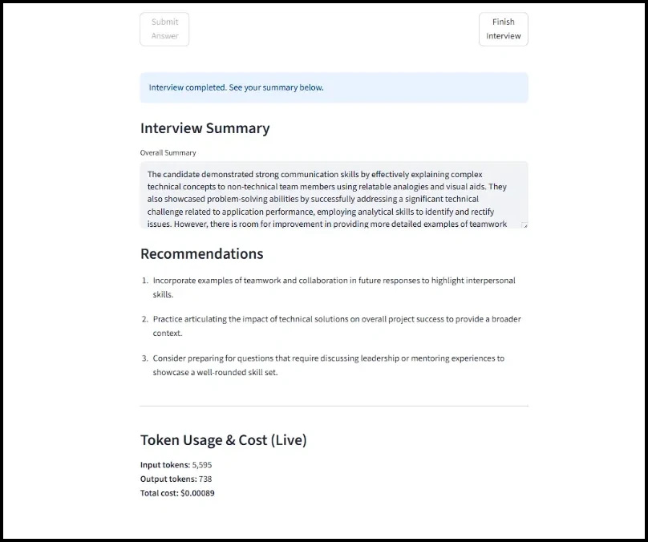

# Interview Practice App

An AI-powered Streamlit application that simulates realistic job interview scenarios. Practice answering interview questions, receive personalized feedback from various evaluation personas, and track your performance with detailed analytics.

[](https://www.python.org/)
[](https://streamlit.io/)
[](LICENSE)
[](https://openai.com/)

---

## Table of Contents

- [Features](#features)
- [Screenshots](#screenshots)
- [Prerequisites](#prerequisites)
- [Installation](#installation)
- [Configuration](#configuration)
- [Usage](#usage)
- [Project Structure](#project-structure)
- [Testing](#testing)
- [Contributing](#contributing)
- [Future Improvements](#future-improvements)
- [License](#license)

---

## Features

### Core Functionality

- **Dynamic Question Generation**: AI generates interview questions tailored to your specified job title, question type (Behavioral, Technical, Case Study, etc.), and difficulty level (Easy, Medium, Hard)
- **Multiple Evaluation Personas**: Receive feedback from different perspectives:
  - Hiring Manager (pragmatic, business-focused)
  - HR Professional (cultural fit, soft skills)
  - Mentor (developmental, supportive)
  - Ideal Candidate (peer comparison)
  - Subject Matter Expert (technical depth)
- **Adaptive Questioning**: Follow-up questions adapt based on your previous answers and performance
- **Real-time Token Usage & Cost Tracking**: Monitor API consumption with live token counts and cost estimates

### Advanced Features

- **Customizable AI Parameters**: Fine-tune the AI behavior with adjustable settings:
  - Model selection (gpt-4o-mini, gpt-4o, gpt-5-mini, gpt-5-nano)
  - Temperature control
  - Max tokens per response
- **Interview Summary & Recommendations**: Comprehensive post-interview analysis with actionable improvement suggestions
- **Job Title Validation**: Smart validation ensures clarity before starting your practice session
- **Mock API Mode**: Practice without consuming API credits using simulated responses

---

## Screenshots

### Start Screen
<br>
*Configure your interview: job title, question type, difficulty, and AI settings*

### Interview View
<br>
*Answer questions and receive immediate feedback from your chosen evaluation persona*

### Advanced Settings
<br>
*Fine-tune AI parameters to customize your practice experience*

### Interview Summary
<br>
*Review your performance with detailed summary and recommendations*

---

## Prerequisites

- **Python**: Version 3.10 or higher
- **OpenAI API Key**: Required for AI-powered features ([Get your API key](https://platform.openai.com/api-keys))
- **Poetry**: Python dependency management tool ([Installation guide](https://python-poetry.org/docs/#installation))

---

## Installation

### 1. Clone the Repository

```bash
git clone https://github.com/SkybrushThriftwood/interview_practice_app.git
cd interview_practice_app
```

### 2. Install Dependencies

Using Poetry (recommended):

```bash
poetry install
```

This will create a virtual environment and install all required dependencies as specified in `pyproject.toml`.

### 3. Configure Environment Variables

Copy the example environment file and add your OpenAI API key:

```bash
cp .env.example .env
```

Edit `.env` and add your credentials:

```env
OPENAI_API_KEY=your_openai_api_key_here
USE_MOCK_API=False
```

> **Note**: Set `USE_MOCK_API=True` to test the application without making actual API calls.

### 4. Run the Application

```bash
poetry run streamlit run app.py
```

The application will open in your default web browser at `http://localhost:8501`.

---

## Configuration

### Environment Variables

The application uses the following environment variables (configured in `.env`):

| Variable | Description | Default | Required |
|----------|-------------|---------|----------|
| `OPENAI_API_KEY` | Your OpenAI API key | - | Yes* |
| `USE_MOCK_API` | Enable mock mode for testing | `False` | No |

\* Not required if `USE_MOCK_API=True`

### AI Model Configuration

Available models (configurable in the UI):
- `gpt-4o-mini` (default, cost-effective)
- `gpt-4o` (more capable, higher cost)
- `gpt-5-mini` (latest mini model)
- `gpt-5-nano` (most economical)

### Advanced Settings

Access advanced AI parameters through the expandable "Advanced AI Settings" section:

- **Temperature**: Control randomness (0.0 = focused, 1.0 = creative)
- **Max Tokens**: Limit response length (50-2000 tokens)
- **Model Selection**: Choose from available OpenAI models

---

## Usage

### Basic Workflow

1. **Launch the Application**
   ```bash
   poetry run streamlit run app.py
   ```

2. **Configure Your Interview**
   - Enter your target job title (e.g., "Software Engineer", "Product Manager")
   - Select question type (Behavioral, Technical, Case Study, etc.)
   - Choose difficulty level (Easy, Medium, Hard)
   - Optionally adjust advanced AI settings

3. **Start Practicing**
   - Click "Start Interview" to begin
   - Read each question carefully
   - Type your answer in the text area
   - Submit to receive immediate feedback

4. **Receive Feedback**
   - Select your preferred evaluation persona
   - Review constructive feedback on your answer
   - Continue with the next question or finish

5. **Review Summary**
   - Click "Finish Interview" when done
   - Review your overall performance summary
   - Read actionable recommendations for improvement
   - Check token usage and estimated costs

### Tips for Best Results

- **Be Specific**: Provide detailed, structured answers using frameworks like STAR (Situation, Task, Action, Result)
- **Experiment with Personas**: Try different evaluation styles to get diverse perspectives
- **Track Your Progress**: Monitor token usage to optimize your practice sessions
- **Use Mock Mode**: Test questions and flow without API costs during initial familiarization

---

## Project Structure

```
interview_practice_app/
├── app.py                      # Main application entry point
├── .env                        # Environment variables (create from .env.example)
├── .env.example                # Example environment configuration
├── pyproject.toml              # Poetry dependencies and project metadata
├── poetry.lock                 # Locked dependency versions
├── LICENSE                     # MIT License
├── README.md                   # This file
│
├── modules/                    # Core application modules
│   ├── config.py               # Configuration constants and settings
│   ├── errors.py               # Custom exception classes
│   ├── error_handling.py       # Error handling utilities
│   ├── interview_logic.py      # Question generation and evaluation logic
│   ├── logging_config.py       # Logging configuration
│   ├── session_state.py        # Streamlit session state management
│   ├── utils.py                # OpenAI API wrapper and utilities
│   ├── validation.py           # Job title validation logic
│   └── ui/                     # UI components
│       ├── ui_helpers.py       # Reusable UI helper functions
│       ├── ui_interview.py     # Main interview interface
│       ├── ui_sidebar.py       # Sidebar configuration
│       └── ui_start_screen.py  # Welcome and setup screen
│
├── prompts/                    # Jinja2 prompt templates
│   ├── evaluation/             # Evaluation persona templates
│   │   ├── base_instructions.j2
│   │   ├── personality_hiring_manager.j2
│   │   ├── personality_hr.j2
│   │   ├── personality_ideal_candidate.j2
│   │   ├── personality_mentor.j2
│   │   └── personality_sme.j2
│   ├── questions/              # Question generation techniques
│   │   ├── base_instructions.j2
│   │   ├── chain_of_thought.j2
│   │   ├── contextual_progression.j2
│   │   ├── few_shot.j2
│   │   └── zero_shot.j2
│   ├── summary/                # Summary generation
│   │   ├── base_instructions.j2
│   │   └── default.j2
│   ├── system/                 # System-level prompts
│   │   ├── evaluation.j2
│   │   ├── job_title_validator.j2
│   │   ├── question.j2
│   │   └── summary_generator.j2
│   └── validation/             # Validation prompts
│       ├── base_instructions.j2
│       └── validate_job_title.j2
│
├── tests/                      # Test suite
│   ├── test_interview_logic.py
│   ├── test_ui_helpers.py
│   └── test_utils.py
│
├── docs/                       # Documentation and screenshots
│   ├── start_screen.png
│   ├── interview_view.png
│   ├── advanced_settings.png
│   └── interview_summary.png
│
└── logs/                       # Application logs (auto-generated)
    ├── app_debug.log
    ├── app_error.log
    └── app_info.log
```

---

## Testing

Basic unit tests included for core logic; coverage focuses on key backend functionality. Streamlit UI and external API calls are demonstrated through the live app.”

### Run All Tests

```bash
poetry run pytest tests/ --disable-warnings -v
```

### Run Specific Test Files

```bash
# Test interview logic
poetry run pytest tests/test_interview_logic.py -v

# Test UI helpers
poetry run pytest tests/test_ui_helpers.py -v

# Test utility functions
poetry run pytest tests/test_utils.py -v
```

### Test Coverage

```bash
poetry run pytest tests/ --cov=modules --cov-report=html
```

This generates an HTML coverage report in `htmlcov/index.html`.

---

## Contributing

Contributions are welcome! Whether it's bug fixes, new features, or documentation improvements, your help is appreciated.

### How to Contribute

1. **Fork the Repository**
   ```bash
   git clone https://github.com/SkybrushThriftwood/interview_practice_app.git
   ```

2. **Create a Feature Branch**
   ```bash
   git checkout -b feature/your-feature-name
   ```

3. **Make Your Changes**
   - Follow PEP 8 style guidelines
   - Add tests for new functionality
   - Update documentation as needed

4. **Run Tests**
   ```bash
   poetry run pytest tests/ --disable-warnings -v
   ```

5. **Commit Your Changes**
   ```bash
   git commit -m "Add: descriptive commit message"
   ```

6. **Push to Your Fork**
   ```bash
   git push origin feature/your-feature-name
   ```

7. **Submit a Pull Request**
   - Provide a clear description of your changes
   - Reference any related issues
   - Ensure all tests pass

### Code Style

- Follow [PEP 8](https://pep8.org/) for Python code style
- Use type hints where appropriate
- Write descriptive docstrings for functions and classes
- Keep functions focused and maintainable

### Reporting Issues

Found a bug or have a feature request? Please [open an issue](https://github.com/SkybrushThriftwood/interview_practice_app/issues) with:
- Clear description of the problem or suggestion
- Steps to reproduce (for bugs)
- Expected vs actual behavior
- Your environment details (Python version, OS, etc.)

---

## Future Improvements

Potential enhancements for future releases:

### Deployment & Infrastructure
- **Cloud Deployment**: Deploy to Streamlit Cloud, Heroku, or Vercel for public access
- **Database Integration**: Persist interview sessions and user data
- **User Authentication**: Add login system for personalized experience

### Features & Functionality
- **Performance Analytics**: Track improvement over time with charts and metrics
- **Question Bank Management**: Review and favorite previously asked questions
- **Custom Question Sets**: Allow users to create and share question collections
- **Audio Responses**: Practice with voice recording and transcription
- **Video Interview Simulation**: Practice with video recording and body language analysis

### UX/UI Enhancements
- **Drag-and-Drop Interface**: Card-based answer management
- **Keyboard Shortcuts**: Improve navigation and efficiency
- **Mobile Optimization**: Enhanced responsive design for mobile devices
- **Dark Mode**: User-selectable theme options
- **Progress Indicators**: Visual feedback for multi-question sessions

### Technical Improvements
- **Caching Layer**: Reduce API calls and improve response times
- **Batch Processing**: Support multiple interview sessions
- **Export Functionality**: Download summaries as PDF or markdown
- **CI/CD Pipeline**: Automated testing and deployment workflows
- **Performance Monitoring**: Track token efficiency and model performance

---

## License

This project is licensed under the MIT License - see the [LICENSE](LICENSE) file for details.

---

## Acknowledgments

- Built with [Streamlit](https://streamlit.io/)
- Powered by [OpenAI API](https://openai.com/)
- Template engine by [Jinja2](https://jinja.palletsprojects.com/)
- Dependency management by [Poetry](https://python-poetry.org/)

---

## Contact & Support

- **GitHub**: [@SkybrushThriftwood](https://github.com/SkybrushThriftwood)
- **Repository**: [interview_practice_app](https://github.com/SkybrushThriftwood/interview_practice_app)
- **Issues**: [Report a bug or request a feature](https://github.com/SkybrushThriftwood/interview_practice_app/issues)

